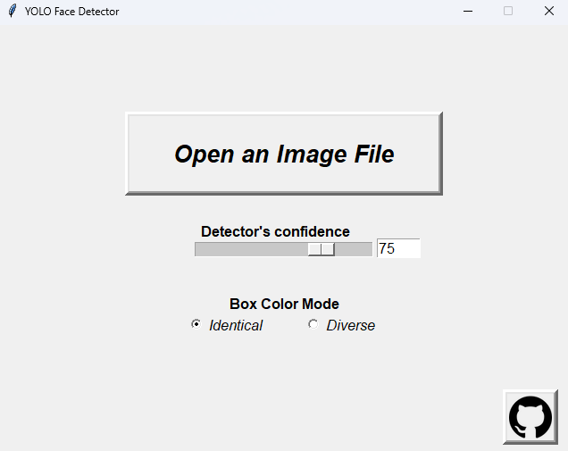
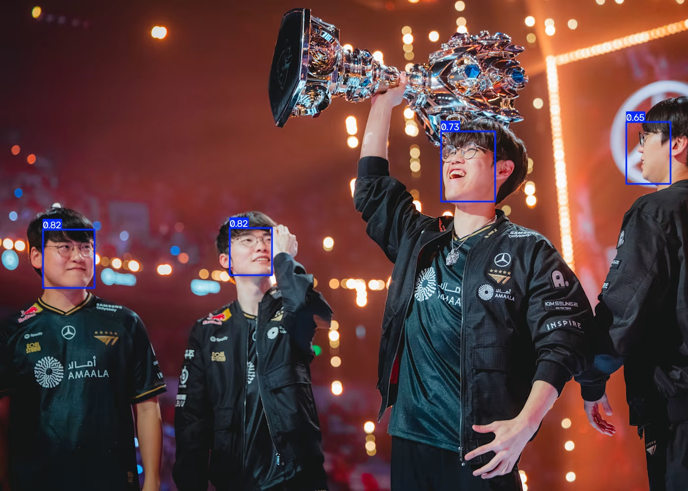
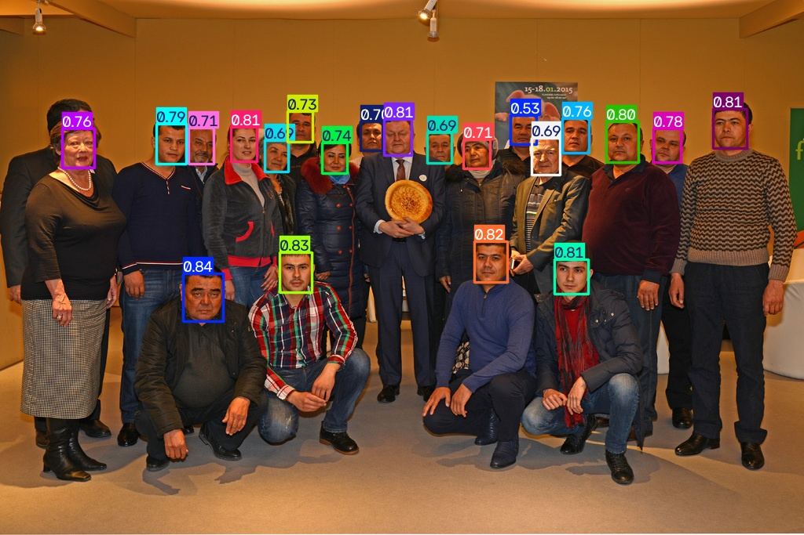
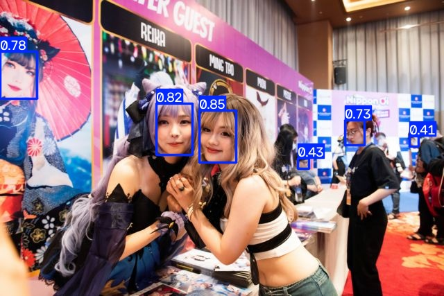

# YOLO FACE DETECTOR GUI APPLICATION

  
  
  
  

## About
**An application focuses on detecting human-like faces from images. Implemented YOLOv8 model of Ultralytics.**
- Dataset source: [Kaggle](https://www.kaggle.com/datasets/fareselmenshawii/face-detection-dataset)
- Training phase: [archived](https://github.com/thangkaka26/YOLO-Face-Detector-GUI-App/tree/1-initial-version/archived)
- More about YOLOv8: [Ultralytics](https://docs.ultralytics.com/models/yolov8)

## Installation
- Download the compressed .rar file (eg. yolo-face-detector-v1.rar) in [release](https://github.com/thangkaka26/YOLO-Face-Detector-GUI-App/releases).
- Extract the .rar then you get a folder containing the application.

## Usage
- Open the executable file `face-detector.exe` and you know what to do.
- Output images are saved in `saves` folder, same directory as the executable file.

## Notes
- Output images are displayed by user's default photo viewer.
- .png and .jpg are worked stably, other formats are not guaranteed.
  
> I did this in my free time, no deadline, just a stuff that an unemployed might do.  
> Im too lazy to write documents, you can check [archived](https://github.com/thangkaka26/YOLO-Face-Detector-GUI-App/tree/1-initial-version/archived).
